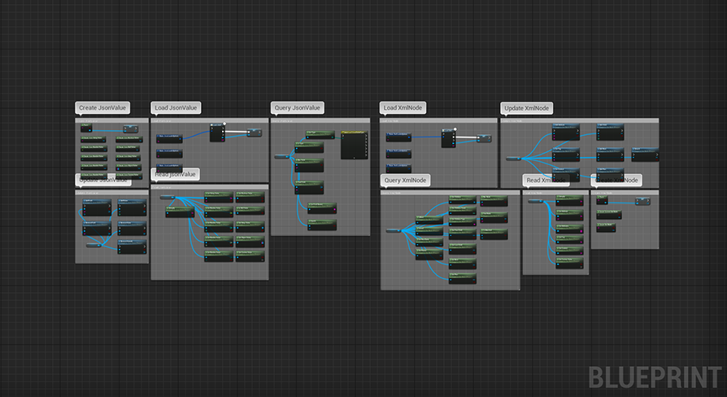
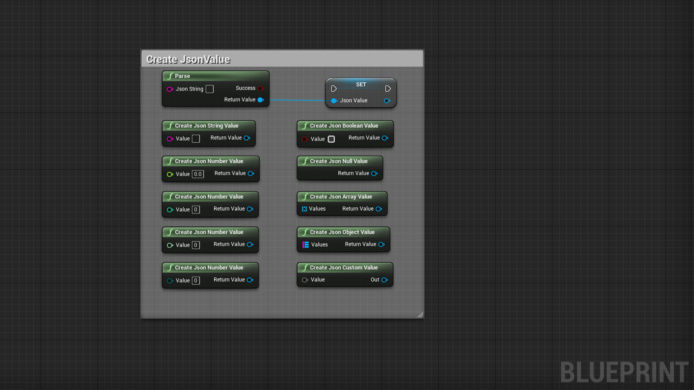
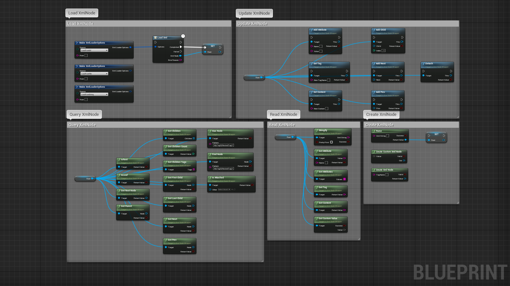
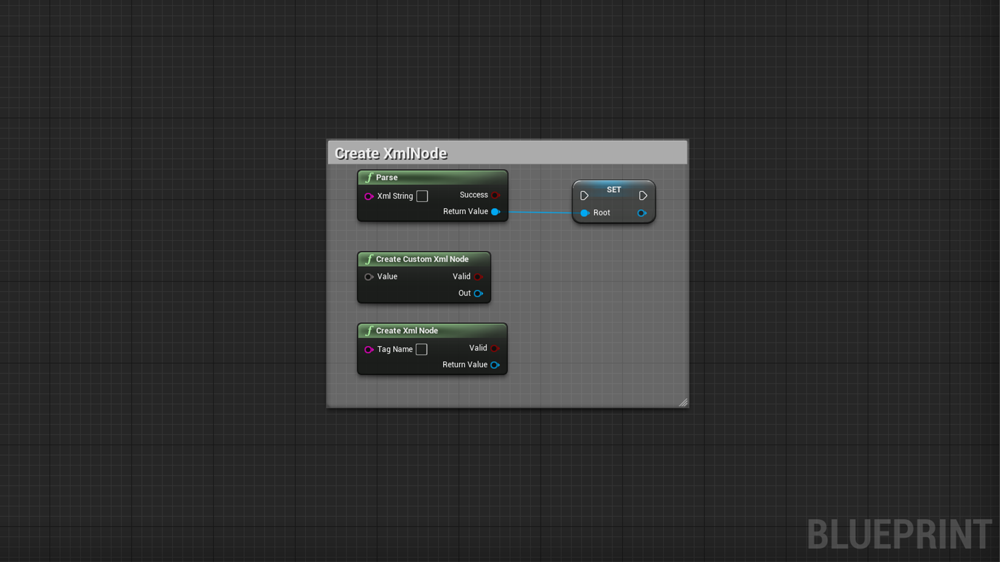

# JSONXMLHelper

- UE plugin to handle JSON and XML manipulation and (de)serialization
- Async load a JSON or XML from file, string or URL (GET)
- (De)serialize struct, object, array, set, maps, int, float, byte, boolean, string... to/from JSON and XML
- Create / Read JSON value (parse and stringify)
- Create / Read XML node (parse and stringify)
- Manipulate JSON or XML entity
- Can be used in any blueprint

 

[Link to the plugin in the marketplace](https://www.unrealengine.com/marketplace/en-US/product/69f737d5e17041079d05044e705f4bee)

# Documentation

 

## Quick conversion

    If you are not interested in updating fields and you want directly the string (stringify) or value (parsing), you can use these quick nodes

| Node | Inputs | Outputs | Note |
| ---- | ------ | ------- | ---- |
| ToJSONString | Wildcard(*), PrettyPrint(Bool) | JSON(String), Success(Bool) | Converts a wildcard value to a JSON string |
| ToXMLString | Wildcard(*), PrettyPrint(Bool) | XML(String), Success(Bool) | Converts a wildcard value to a XML string |
| FromJSONString | JSON(String) | Success(Bool), Wildcard(*) | Converts a JSON string to a wildcard value |
| FromXMLString | XML(String) | Success(Bool), Wildcard(*) | Converts a XML string to a wildcard value |

 

# JSON

 

## Load JSONValue

    Note: When using "LoadFromUrl", a GET request will be performed against the provided Url, then the result will be parsed into JSON if valid

| Node | Inputs | Outputs | Note |
| ---- | ------ | ------- | ---- |
| LoadJSON | Options(JSONLoaderOptions) | Completed(JSONValue(JSONValueWrapper)), Failed(ErrorReason(String)) | Asynchronous load a JSONValue from (string or file or url), completed is called when the conversion was successful, failed otherwise with the error reason |

 

## Create JSONValue

    Note: Do not use withespaces or special symbols in your struct to avoid deserialization/parsing errors, prefer using camelCase or PascalCase

    You can easily create nested objects/arrays using these nodes, carefull not to create loops in the JSON tree as it can cause a crash !

| Node | Inputs | Outputs | Note |
| ---- | ------ | ------- | ---- |
| Parse | JSONString(String) | Result(Bool), JSONValue(JSONValueWrapper) | (Deserialize) Synchronous parse a string into a JSON value, use LoadJSON for async capabilities |
| CreateJSONStringValue | Value(String) | Result(JSONValueWrapper) | Creates a JSON string from a string value |
| CreateJSONNumberValue | Value(float) | Result(JSONValueWrapper) | Creates a JSON number from a float value |
| CreateJSONNumberValue | Value(Int) | Result(JSONValueWrapper) | Creates a JSON number from an integer value |
| CreateJSONNumberValue | Value(Int64) | Result(JSONValueWrapper) | Creates a JSON number from an integer64 value |
| CreateJSONNumberValue | Value(Byte) | Result(JSONValueWrapper) | Creates a JSON number from a byte value |
| CreateJSONBooleanValue | Value(Bool) | Result(JSONValueWrapper) | Creates a JSON boolean from a bool value |
| CreateJSONNullValue | void | Result(JSONValueWrapper) | Creates a JSON null value |
| CreateJSONArrayValue | Values(Array(JSONValueWrapper)) | Result(JSONValueWrapper) | Creates a JSON value from an array of JSON values |
| CreateJSONObjectValue | Values(Map(String, JSONValueWrapper)) | Result(JSONValueWrapper) | Creates a JSON object from a map of JSON values |
| CreateJSONCustomValue | Value(AnyStruct) | Out(JSONValueWrapper) | Creates a JSON value from any struct provided |

 

## Query JSONValue

    Note: To create a pattern query, use a field name or numeric value if the value is an array, separate the query elements by "/" : example: "MyField/0/OtherField/1", this will return a JSONValue located inside a field called MyField, then at the index 0 of the array, then inside a field called OtherField, then at the index 1 of the array inside OtherField !

    You can easily query nested JSONValue using this syntax pattern

| Node | Inputs | Outputs | Note |
| ---- | ------ | ------- | ---- |
| GetType | void | Result(EJSONValueType) | Retuns the type of the value contained inside the JSONValue |
| IsType | Filter(EJSONValueType) | Result(Bool) | Returns true if the type matches the type of the value inside the JSONValue |
| HasField | Pattern(String), FilterType(EJSONValueType) | Result(Bool) | Checks recursively whether a specific key exists inside the JSONValue using a pattern |
| FindField | Pattern(String), FilterType(EJSONValueType) | Result(Bool), Value(JSONValueWrapper) | Finds recursively a specific key inside the JSONValue using a pattern |
| GetFieldNames | void | Result(Bool), FieldNames(Array(String)) | If JSONValue is an object, returns the field names of this object |
| Equals | Other(JSONValueWrapper) | Result(Bool) | Compare two JSONValue to find out if they are equal |

 

## Read JSONValue

| Node | Inputs | Outputs | Note |
| ---- | ------ | ------- | ---- |
| Stringify | PrettyPrint(Bool) | Result(Bool), JSONString(String) | (Serialize) Converts a JSONValue into a string, printing the value on multiple rows or not to save characters |
| GetStringValue | Default(String) | Result(Bool), Value(String) | Returns a string or default value if conversion is not valid |
| GetNumberValue | Default(Float) | Result(Bool), Value(Float) | Returns a float or default value if conversion is not valid |
| GetNumberValue | Default(Int) | Result(Bool), Value(Int) | Returns an int or default value if conversion is not valid |
| GetNumberValue | Default(Int64) | Result(Bool), Value(Int64) | Returns an int64 or default value if conversion is not valid |
| GetNumberValue | Default(Byte) | Result(Bool), Value(Byte) | Returns a byte or default value if conversion is not valid | 
| GetBooleanValue | Default(Bool) | Result(Bool), Value(Bool) | Returns a boolean or default value if conversion is not valid |
| IsNullValue | void | bool | Returns true if the JSONValue contains null |
| GetArrayValue | void | Result(Bool), Values(Array(JSONValueWrapper)) | Returns an array filled with JSONValue if conversion is valid |
| GetObjectValue | void | Result(Bool), Values(Map(String, JSONValueWrapper)) | Returns a map filled with field name as key and JSONValue as value if conversion is valid |
| GetCustomValue | void | Success(Bool), Value(AnyStruct) | Tries to fill the provided struct with the JSONValue if conversion is possible |

 

## Update JSONValue

    Note: Carefull not to create loops in the JSON tree as it can cause a crash !

| Node | Inputs | Outputs | Note |
| ---- | ------ | ------- | ---- |
| AddField | FieldName(String), FieldValue(JSONValueWrapper) | Success(Bool), Result(JSONValueWrapper) | If the JSONValue is an object, this adds a new field, and returns the updated version or nullptr if fail |
| RemoveField | FieldName(String) | Success(Bool), Result(JSONValueWrapper) | If the JSONValue is an object, this removes a new field, and returns the updated version or nullptr if fail |
| AddValue | Value(JSONValueWrapper), Index(Int) | Success(Bool), Result(JSONValueWrapper) | If the JSONValue is an array, this adds a new value, and returns the updated version or nullptr if fail |
| RemoveValue | Value(JSONValueWrapper) | Success(Bool), Result(JSONValueWrapper) | If the JSONValue is an array, this removes a value, and returns the updated version or nullptr if fail |
| RemoveValueAt | Index(Int) | Success(Bool), Result(JSONValueWrapper) | If the JSONValue is an array, this removes a specific index value, and returns the updated version or nullptr if fail |

 

# XML

## Load XMLNode

    Note: When using "LoadFromUrl", a GET request will be performed against the provided Url, then the result will be parsed into XML if valid

| Node | Inputs | Outputs | Note |
| ---- | ------ | ------- | ---- |
| LoadXML | Options(XMLLoaderOptions) | Completed(XMLNode(XMLNodeWrapper)), Failed(ErrorReason(String)) | Asynchronous load an XMLNode from (string or file or url), completed is called when the conversion was successful, failed otherwise with the error reason |

 

## Create XMLNode

    Note: Do not use withespaces or special symbols in your struct to avoid deserialization/parsing errors, prefer using camelCase or PascalCase

| Node | Inputs | Outputs | Note |
| ---- | ------ | ------- | ---- |
| Parse | XMLString(String) | Success(Bool), Result(XMLNodeWrapper) | (Deserialize) Synchronous parse a string into an XMLNode, use LoadXML for async capabilities | 
| CreateCustomXMLNode | Value(AnyStruct) | Valid(Bool), Result(XMLNodeWrapper) | Converts any struct to an XML node if it's possible |
| CreateXMLNode | TagName(String) | Valid(Bool), Result(XMLNodeWrapper) | Creates a new XML Node with a valid tag name or nullptr if fail |

 

## Query XMLNode

    Note: To create a pattern query, use a tag name or numeric value, separate the query elements by "/" : example: "MyTag/0/NestedTag/1", this will return an XMLNode located inside a node called MyTag, then at the index 0 of the array, then inside a node called NestedTag, then at the index 1 of the array inside NestedTag !

    You can easily query nested XMLNode using this syntax pattern

| Node | Inputs | Outputs | Note |
| ---- | ------ | ------- | ---- |
| IsRootNode | void | Result(Bool) | Checks whether the current node is the root node of the XML tree |
| IsLeafNode | void | Result(Bool) | Checks whether the current node is a leaf node in the XML tree |
| GetRootNode | void | Result(XMLNodeWrapper) | Returns the root node of the current node |
| GetParent | void | Result(Bool), Parent(XMLNodeWrapper) | Returns the parent node if there is one |
| GetChildren | void | Children(Array(XMLNodeWrapper)) | Returns the children nodes |
| GetChildrenCount | void | Result(Int) | Returns the amount of children this node has |
| GetChildrenTags | void | Tags(Array(String)) | Returns the name tags of the children this node has |
| GetFirstChild | void | Result(Bool), Child(XMLNodeWrapper) | Returns the first child of the current node if there is one |
| GetLastChild | void | Result(Bool), Child(XMLNodeWrapper) | Returns the last child of the current node if there is one |
| GetNext | void | Result(Bool), Next(XMLNodeWrapper) | Returns the next sibling of the current node if there is one |
| GetPrev | void | Result(Bool), Prev(XMLNodeWrapper) | Returns the previous sibling of the current node if there is one |
| HasNode | Pattern(String) | Result(Bool) | Checks recursively whether a specific node exists using a search pattern |
| FindNode | Pattern(String) | Result(Bool), Node(XMLNodeWrapper) | Finds recursively a specific node using a search pattern |
| IsAttached | Other(XMLNodeWrapper) | Result(Bool) | Checks whether the current node is attached to the other node |

 

## Read XMLNode

| Node | Inputs | Outputs | Note |
| ---- | ------ | ------- | ---- |
| Stringify | PrettyPrint(Bool) | Result(Bool), XMLString(String) | (Serialize) Converts a XMLNode into a string, printing the value on multiple rows or not to save characters |
| GetAttribute | Name(String) | Result(Bool), Value(String) | Gets the attribute value with a specific name if it exists |
| GetAttributes | void | Attributes(Map(String, String)) | Gets all attributes of the current node |
| GetTag | void | Result(String) | Returns the tag of the current node |
| GetContent | void | Result(String) | Returns the content of the current node |
| GetCustomValue | void | Success(Bool), Value(AnyStruct) | Converts an XML Node to any struct if it's possible |

 

## Update XMLNode

| Node | Inputs | Outputs | Note |
| ---- | ------ | ------- | ---- |
| AddAttribute | Name(String), Value(String) | Result(Bool), This(XMLNodeWrapper) | Adds an attribute if the name is valid, returns this node for chaining |
| SetTag | Name(String) | Result(Bool), This(XMLNodeWrapper) | Updates the tag name if the new name is valid, returns this node for chaining |
| SetContent | Content(String) | This(XMLNodeWrapper) | Sets the content of the node, returns this node for chaining |
| AddChild | Child(XMLNodeWrapper), Index(Int) | Result(Bool), This(XMLNodeWrapper) | Adds a child to the current node at index, returns this node for chaining |
| AddNext | Next(XMLNodeWrapper) | Result(Bool), This(XMLNodeWrapper) | Adds a next sibling to the current node, returns this node for chaining |
| AddPrev | Prev(XMLNodeWrapper) | Result(Bool), This(XMLNodeWrapper) | Adds a previous sibling to the current node, returns this node for chaining |
| Detach | void | Result(Bool), This(XMLNodeWrapper) | Detaches the current node from it's parent, returns this node for chaining |