# JSONXMLHelper

 

# About

- UE plugin to handle easily JSON and XML (de)serialization
- Async load JSON and XML from file, string or URL (GET)
- Converts datatable, struct, object, array, set, maps, int, float, byte, boolean, string... to/from JSON and XML
- Create / Read JSON value (parse and stringify)
- Create / Read XML node (parse and stringify)
- Update JSON or XML entity
- Can be used in any blueprint

# Setup

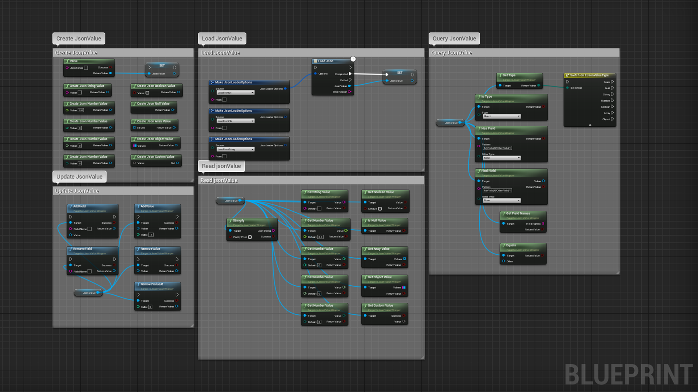

1. [Get the plugin on the marketplace](https://www.unrealengine.com/marketplace/en-US/product/json-xml-helper) and install the plugin for the engine version you wish to use
2. Create or open an unreal engine project with a supported version
3. In the editor, go to Edit/Plugins, search for the plugin, check the box to enable it and restart the editor
4. When a new plugin version is available, go to your Epic Games Launcher, under Unreal Engine/Library, below the engine version, you will find your installed plugins, find the plugin and click on update, then wait for it to finish and restart your editor

 

# Support

### Bugs/Issues

If you encounter issues with this plugin, you **should** report it, to do so, in the editor, go to Edit/Plugins, search for this plugin, click on the plugin support button, this will open your browser and navigate to the plugin issue form where you need to fill in all the relevant details about your issue, this will help me investigate and reproduce it on my own in order to fix it. Be precise and give as many details as you can. Once solved, a new plugin version will be submitted to the marketplace, update the plugin and you are good to go. **Due to epic marketplace limitations, I can only patch/update this plugin for the last 3 engine version, older engine versions will not be supported anymore.**

### Feature requests

If you want a new feature relevant to this plugin use case, you can submit a request in the [plugin marketplace question page](https://www.unrealengine.com/marketplace/en-US/product/json-xml-helper/questions). I **may** add this new feature in a future plugin version.

 

# Documentation

_Screenshots may differ from the latest plugin version, some features may have evolved or have been removed if deprecated._

### Utility

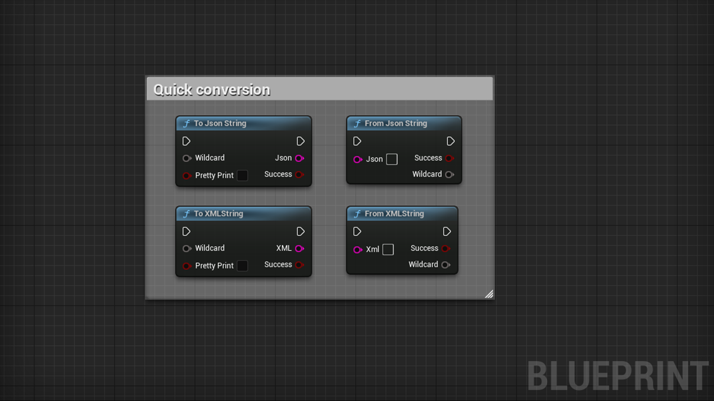

_If you are not interested in updating fields and you want directly the string (stringify) or value (parsing), you can use these quick conversion nodes_

| Node | Inputs | Outputs | Note |
| ---- | ------ | ------- | ---- |
| ToJSONString | Wildcard(*), PrettyPrint(Bool) | Json(String), Success(Bool) | Converts a wildcard value to a json string, can be compressed or pretty print |
| FromJSONString | Json(String) | Success(Bool), Wildcard(*) | Converts a json string to a wildcard value |
| ToXMLString | Wildcard(*), PrettyPrint(Bool) | Xml(String), Success(Bool) | Converts a wildcard value to a xml string, can be compressed or pretty print |
| FromXMLString | Xml(String) | Success(Bool), Wildcard(*) | Converts a xml string to a wildcard value |

 

### JSON

_JSON stands for JavaScript Object Notation, JSON is a lightweight format for storing and exchanging data._

#### Load JSONValue

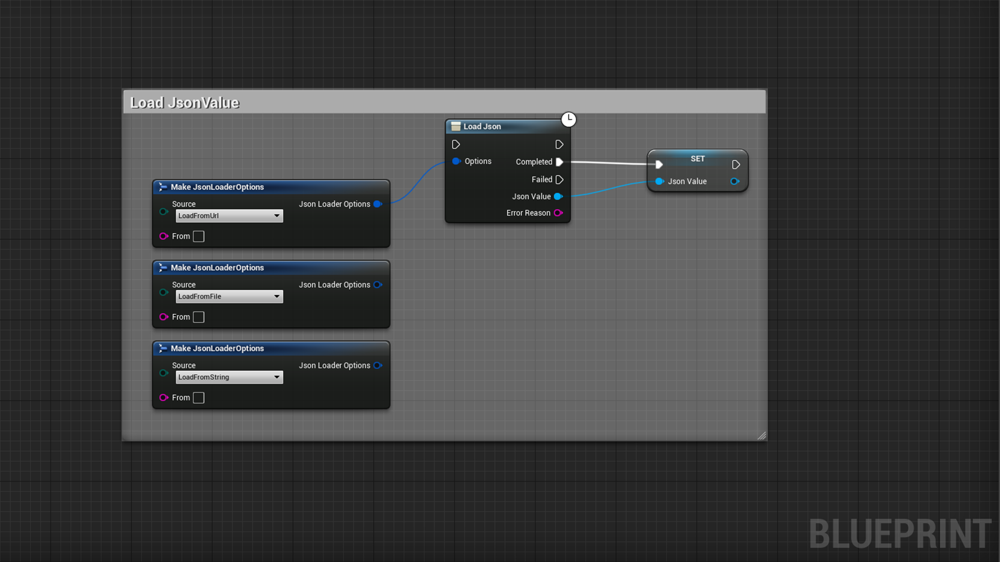

_When using "LoadFromUrl", a GET request will be performed against the provided Url, then the result will be parsed into JSON if valid_

**EJsonLoaderSource** is an enum used to enumerate all the supported JSON sources

**FJsonLoaderOptions** is a struct used to provide load options like Source, From to load a file, a buffer or an url

| Node | Inputs | Outputs | Note |
| ---- | ------ | ------- | ---- |
| LoadJSON | Options(FJsonLoaderOptions) | | Asynchronous load a JSON value from a source |
| Completed | | JsonValue(UJsonValueWrapper), ErrorReason(FString) | Event triggered when the loading is completed successfully |
| Failed | | JsonValue(UJsonValueWrapper), ErrorReason(FString) | Event triggered when an error occured |

 

#### Create JSONValue

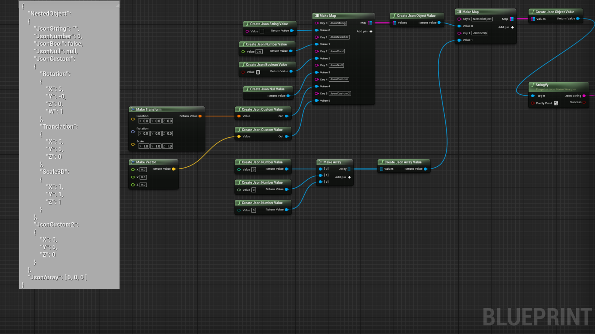

_It is recommended to not use withespaces or special symbols in your struct to avoid deserialization/parsing errors, prefer using camelCase or PascalCase_

_You can easily create nested objects/arrays using these nodes, carefull not to create loops in the JSON tree as it can cause a crash_

| Node | Inputs | Outputs | Note |
| ---- | ------ | ------- | ---- |
| Parse | JSONString(String) | Result(Bool), JSONValue(JSONValueWrapper) | (Deserialize) Synchronous parse a string into a JSON value, use LoadJSON for async capabilities |
| CreateJSONStringValue | Value(String) | Result(JSONValueWrapper) | Creates a JSON string from a string value |
| CreateJSONNumberValue | Value(float) | Result(JSONValueWrapper) | Creates a JSON number from a float value |
| CreateJSONNumberValue | Value(Int) | Result(JSONValueWrapper) | Creates a JSON number from an integer value |
| CreateJSONNumberValue | Value(Int64) | Result(JSONValueWrapper) | Creates a JSON number from an integer64 value |
| CreateJSONNumberValue | Value(Byte) | Result(JSONValueWrapper) | Creates a JSON number from a byte value |
| CreateJSONBooleanValue | Value(Bool) | Result(JSONValueWrapper) | Creates a JSON boolean from a bool value |
| CreateJSONNullValue | | Result(JSONValueWrapper) | Creates a JSON null value |
| CreateJSONArrayValue | Values(Array(JSONValueWrapper)) | Result(JSONValueWrapper) | Creates a JSON value from an array of JSON values |
| CreateJSONObjectValue | Values(Map(String, JSONValueWrapper)) | Result(JSONValueWrapper) | Creates a JSON object from a map of JSON values |
| CreateJSONCustomValue | Value(AnyStruct) | Out(JSONValueWrapper) | Creates a JSON value from any struct provided |
| CreateJsonDataTable | Value(Datatable) | Result(JSONValueWrapper) | Creates a JSON value from a datatable, make sure the row struct is defined |

 

#### Query JSONValue

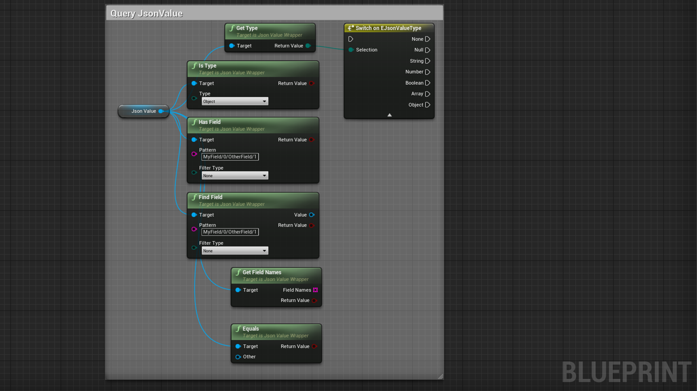

**EJsonValueType** is an enum used to enumerate all the supported value type

_To create a nested pattern query, use a field name or numeric value if the value is an array, separate the query elements by "/" : example: "MyField/0/OtherField/1", this will return a JSONValue located inside a field called MyField, then at the index 0 of the array, then inside a field called OtherField, then at the index 1 of the array inside OtherField_

| Node | Inputs | Outputs | Note |
| ---- | ------ | ------- | ---- |
| GetType | | Result(EJSONValueType) | Retuns the type of the value contained inside the JSONValue |
| IsType | Filter(EJSONValueType) | Result(Bool) | Returns true if the type matches the type of the value inside the JSONValue |
| HasField | Pattern(String), FilterType(EJSONValueType) | Result(Bool) | Checks recursively whether a specific key exists inside the JSONValue using a pattern |
| FindField | Pattern(String), FilterType(EJSONValueType) | Result(Bool), Value(JSONValueWrapper) | Finds recursively a specific key inside the JSONValue using a pattern |
| GetFieldNames | | Result(Bool), FieldNames(Array(String)) | If JSONValue is an object, returns the field names of this object |
| Equals | Other(JSONValueWrapper) | Result(Bool) | Compare two JSONValue to find out if they are equal |

 

#### Read JSONValue

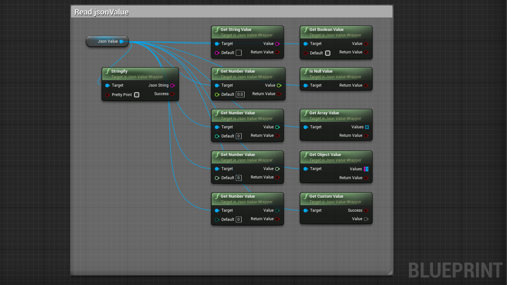

| Node | Inputs | Outputs | Note |
| ---- | ------ | ------- | ---- |
| Stringify | PrettyPrint(Bool) | Result(Bool), JSONString(String) | (Serialize) Converts a JSONValue into a string, printing the value on multiple rows or not to save characters |
| GetStringValue | Default(String) | Result(Bool), Value(String) | Returns a string or default value if conversion is not valid |
| GetNumberValue | Default(Float) | Result(Bool), Value(Float) | Returns a float or default value if conversion is not valid |
| GetNumberValue | Default(Int) | Result(Bool), Value(Int) | Returns an int or default value if conversion is not valid |
| GetNumberValue | Default(Int64) | Result(Bool), Value(Int64) | Returns an int64 or default value if conversion is not valid |
| GetNumberValue | Default(Byte) | Result(Bool), Value(Byte) | Returns a byte or default value if conversion is not valid | 
| GetBooleanValue | Default(Bool) | Result(Bool), Value(Bool) | Returns a boolean or default value if conversion is not valid |
| IsNullValue | | bool | Returns true if the JSONValue contains null |
| GetArrayValue | | Result(Bool), Values(Array(JSONValueWrapper)) | Returns an array filled with JSONValue if conversion is valid |
| GetObjectValue | | Result(Bool), Values(Map(String, JSONValueWrapper)) | Returns a map filled with field name as key and JSONValue as value if conversion is valid |
| GetCustomValue | | Success(Bool), Value(AnyStruct) | Tries to fill the provided struct with the JSONValue if conversion is possible |
| GetDataTableValue | RowStruct(ScriptStruct) | Result(Bool), Value(DataTable) | Returns a datatable using a row struct and filled with data |

 

#### Update JSONValue

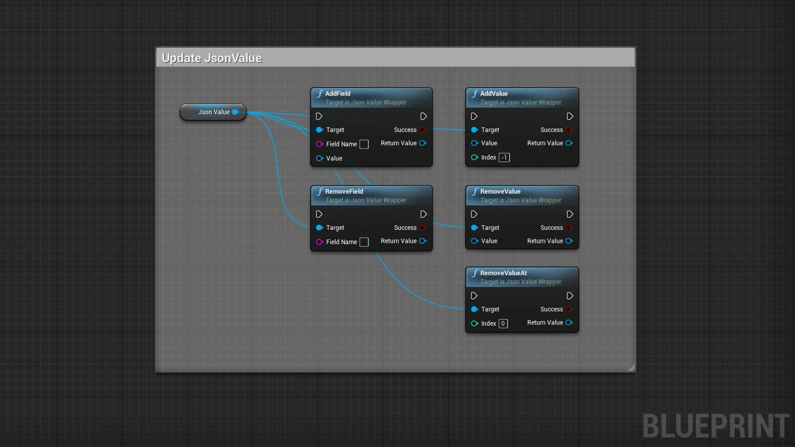

_Carefull not to create loops in the JSON tree as it can cause a crash_

| Node | Inputs | Outputs | Note |
| ---- | ------ | ------- | ---- |
| AddField | FieldName(String), FieldValue(JSONValueWrapper) | Success(Bool), Result(JSONValueWrapper) | If the JSONValue is an object, this adds a new field, and returns the updated version or nullptr if fail |
| RemoveField | FieldName(String) | Success(Bool), Result(JSONValueWrapper) | If the JSONValue is an object, this removes a new field, and returns the updated version or nullptr if fail |
| AddValue | Value(JSONValueWrapper), Index(Int) | Success(Bool), Result(JSONValueWrapper) | If the JSONValue is an array, this adds a new value, and returns the updated version or nullptr if fail |
| RemoveValue | Value(JSONValueWrapper) | Success(Bool), Result(JSONValueWrapper) | If the JSONValue is an array, this removes a value, and returns the updated version or nullptr if fail |
| RemoveValueAt | Index(Int) | Success(Bool), Result(JSONValueWrapper) | If the JSONValue is an array, this removes a specific index value, and returns the updated version or nullptr if fail |

 

### XML

_XML stands for eXtensible Markup Language, XML was designed to store and exchange data, XML is more descriptive than JSON._

#### Load XMLNode

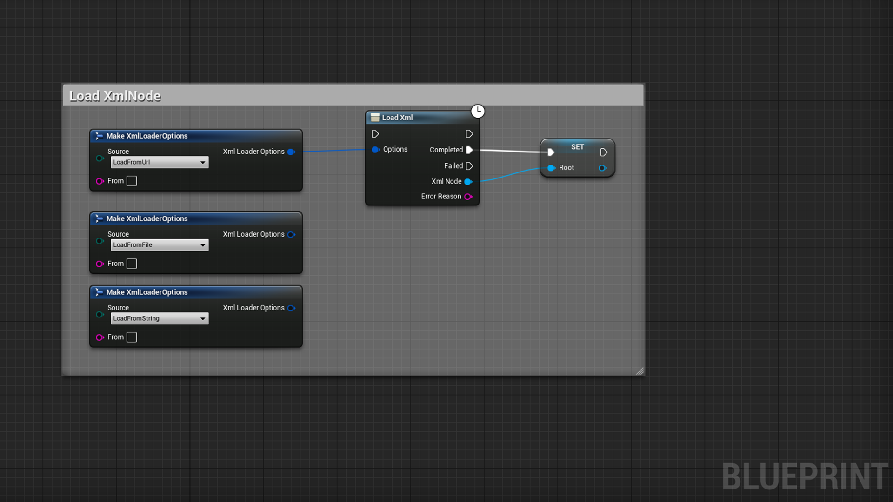

_When using "LoadFromUrl", a GET request will be performed against the provided Url, then the result will be parsed into XML if valid_

**EXmlLoaderSource** is an enum used to enumerate all the supported XML sources

**FXmlLoaderOptions** is a struct used to provide load options like Source, From to load a file, a buffer or an url

| Node | Inputs | Outputs | Note |
| ---- | ------ | ------- | ---- |
| LoadXML | Options(FXmlLoaderOptions) | | Asynchronous load an XML value from a source |
| Completed | | XmlNode(UXmlNodeWrapper), ErrorReason(FString) | Event triggered when the loading is completed successfully |
| Failed | | XmlNode(UXmlNodeWrapper), ErrorReason(FString) | Event triggered when an error occured |

 

#### Create XMLNode

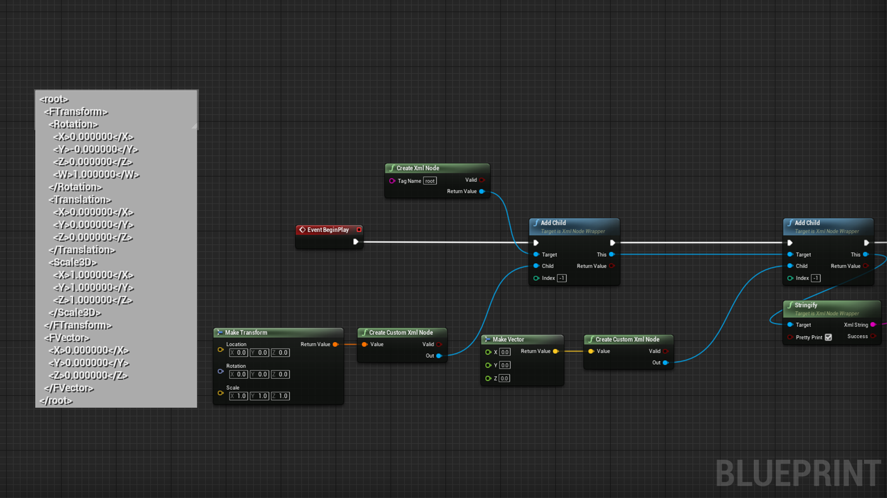

_It is recommended to not use withespaces or special symbols in your struct to avoid deserialization/parsing errors, prefer using camelCase or PascalCase_

| Node | Inputs | Outputs | Note |
| ---- | ------ | ------- | ---- |
| Parse | XMLString(String) | Success(Bool), Result(XMLNodeWrapper) | (Deserialize) Synchronous parse a string into an XMLNode, use LoadXML for async capabilities | 
| CreateCustomXMLNode | Value(AnyStruct) | Valid(Bool), Result(XMLNodeWrapper) | Converts any struct to an XML node if it's possible |
| CreateXMLNode | TagName(String) | Valid(Bool), Result(XMLNodeWrapper) | Creates a new XML Node with a valid tag name or nullptr if fail |
| CreateXmlDataTableNode | Value(DataTable) | Result(XMLNodeWrapper) | Creates a XML Node from a datatable, make sure the row struct is defined |

 

#### Query XMLNode

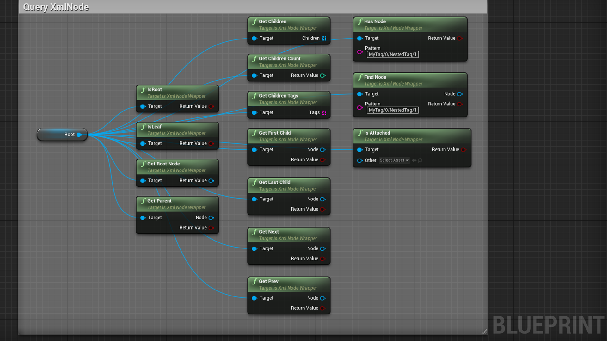

_To create a nested pattern query, use a tag name or numeric value if the value is an array, separate the query elements by "/" : example: "MyTag/0/NestedTag/1", this will return a XMLNode located inside a node called MyTag, then at the index 0 of the array, then inside a node called NestedTag, then at the index 1 of the array inside NestedTag_

| Node | Inputs | Outputs | Note |
| ---- | ------ | ------- | ---- |
| IsRootNode | | Result(Bool) | Checks whether the current node is the root node of the XML tree |
| IsLeafNode | | Result(Bool) | Checks whether the current node is a leaf node in the XML tree |
| GetRootNode | | Result(XMLNodeWrapper) | Returns the root node of the current node |
| GetParent | | Result(Bool), Parent(XMLNodeWrapper) | Returns the parent node if there is one |
| GetChildren | | Children(Array(XMLNodeWrapper)) | Returns the children nodes |
| GetChildrenCount | | Result(Int) | Returns the amount of children this node has |
| GetChildrenTags | | Tags(Array(String)) | Returns the name tags of the children this node has |
| GetFirstChild | | Result(Bool), Child(XMLNodeWrapper) | Returns the first child of the current node if there is one |
| GetLastChild | | Result(Bool), Child(XMLNodeWrapper) | Returns the last child of the current node if there is one |
| GetNext | | Result(Bool), Next(XMLNodeWrapper) | Returns the next sibling of the current node if there is one |
| GetPrev | | Result(Bool), Prev(XMLNodeWrapper) | Returns the previous sibling of the current node if there is one |
| HasNode | Pattern(String) | Result(Bool) | Checks recursively whether a specific node exists using a search pattern |
| FindNode | Pattern(String) | Result(Bool), Node(XMLNodeWrapper) | Finds recursively a specific node using a search pattern |
| IsAttached | Other(XMLNodeWrapper) | Result(Bool) | Checks whether the current node is attached to the other node |

 

#### Read XMLNode

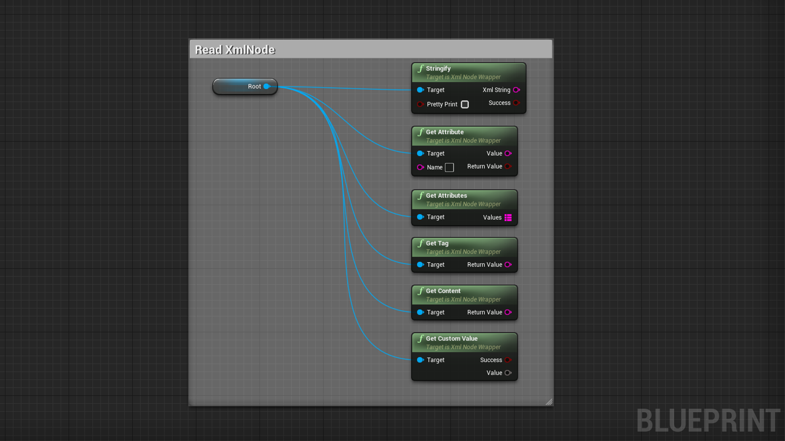

| Node | Inputs | Outputs | Note |
| ---- | ------ | ------- | ---- |
| Stringify | PrettyPrint(Bool) | Result(Bool), XMLString(String) | (Serialize) Converts a XMLNode into a string, printing the value on multiple rows or not to save characters |
| GetAttribute | Name(String) | Result(Bool), Value(String) | Gets the attribute value with a specific name if it exists |
| GetAttributes | | Attributes(Map(String, String)) | Gets all attributes of the current node |
| GetTag | | Result(String) | Returns the tag of the current node |
| GetContent | | Result(String) | Returns the content of the current node |
| GetCustomValue | | Success(Bool), Value(AnyStruct) | Converts an XML Node to any struct if it's possible |
| GetDataTableValue | RowStruct(ScriptStruct) | Result(Bool), Value(DataTable) | Returns a datatable using a row struct and filled with data |

 

#### Update XMLNode

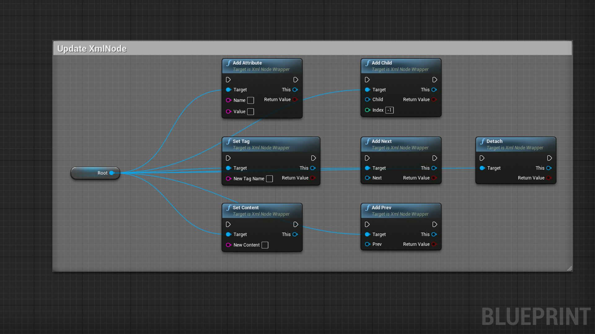

| Node | Inputs | Outputs | Note |
| ---- | ------ | ------- | ---- |
| AddAttribute | Name(String), Value(String) | Result(Bool), This(XMLNodeWrapper) | Adds an attribute if the name is valid, returns this node for chaining |
| SetTag | Name(String) | Result(Bool), This(XMLNodeWrapper) | Updates the tag name if the new name is valid, returns this node for chaining |
| SetContent | Content(String) | This(XMLNodeWrapper) | Sets the content of the node, returns this node for chaining |
| AddChild | Child(XMLNodeWrapper), Index(Int) | Result(Bool), This(XMLNodeWrapper) | Adds a child to the current node at index, returns this node for chaining |
| AddNext | Next(XMLNodeWrapper) | Result(Bool), This(XMLNodeWrapper) | Adds a next sibling to the current node, returns this node for chaining |
| AddPrev | Prev(XMLNodeWrapper) | Result(Bool), This(XMLNodeWrapper) | Adds a previous sibling to the current node, returns this node for chaining |
| Detach | | Result(Bool), This(XMLNodeWrapper) | Detaches the current node from it's parent, returns this node for chaining |